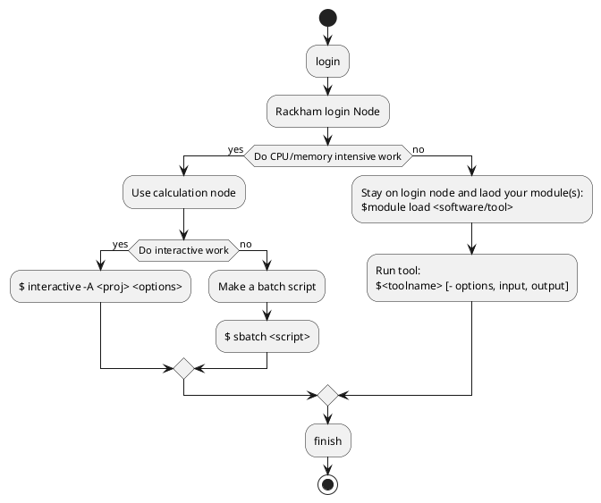
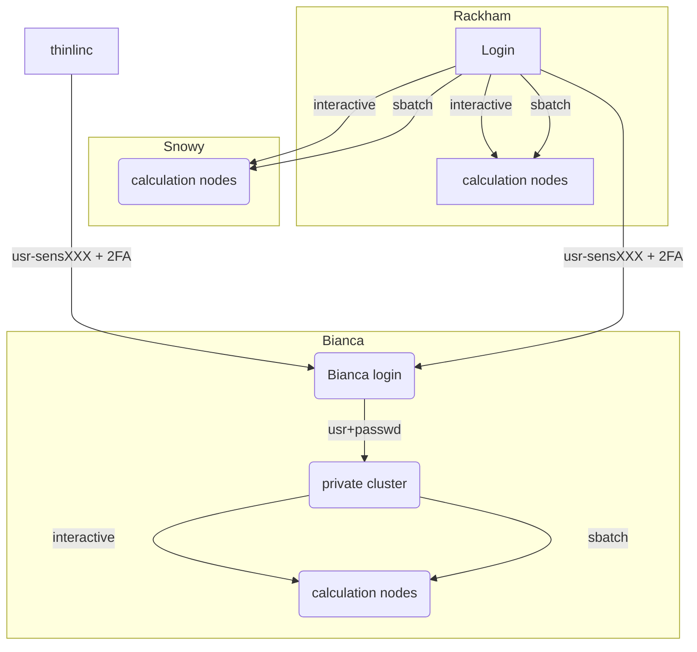

# Working on UPPMAX 

## ``$HOME`` dir and project dir

### Quota
- Disk usage and number of files
- ``$HOME`` has always 32 GB and 300,000 files
- You typically have one project per project, their size dependent on type of project
- Compute projects both have disk space (128 GB) and computing time attached to them

### Core hours
- You  get core hours only from compute project
- When they are used you can still get "BONUS" jobs if the resources allow.

## What kind of work will you perform?

### UPPMAX Cluster overview again!

!!! tip "Keypoints"
    - Use your disk spaces wisely
        - home folder just for general stuff and files needed by several projects
          - always read and write protected for others by default
        - otherside project folder which will more easily become public for other's
          - by default available for all project members.
    - Use the computing resources wisely
        - low intensity work on login node
        - high intensity work on compute nodes (core hours are counted)
            - for development use the interactive sessions
            - otherwise make batch jobs!

## Common problems

- Conda environment clash with loaded python modules
- Forgotten environment variables defined in your `.bashrc` may give unexeptected errors when you run other programs or new versions of a program
- A full ``$HOME`` folder may cause unexpected errors
  - check with ``uquota``

!!! tip "Exercise 1: Transfering files (10 min)"

    1. Login to rackham and start by creating a personal directory under the
       project storage: `/proj/uppmax2020-2-2/{your-username}`
    2. Next create an empty text file on local computer. E.g. `touch
       my_file.txt`
    3. Transfer the file to the directory you created in step 1 `scp`, `rsync`
       or a graphical interface.
    4. From `rackham`, now open `my_file.txt`, add some arbitrary text using
       e.g. `vim, nano` or `emacs` and then transfer it back to your local
       computer.    

    **Hint:** For more information about transfering files see:
    <https://www.uppmax.uu.se/support/faq/login-problems-faq/moving-files-between-uppmax-and-local-computer/>

